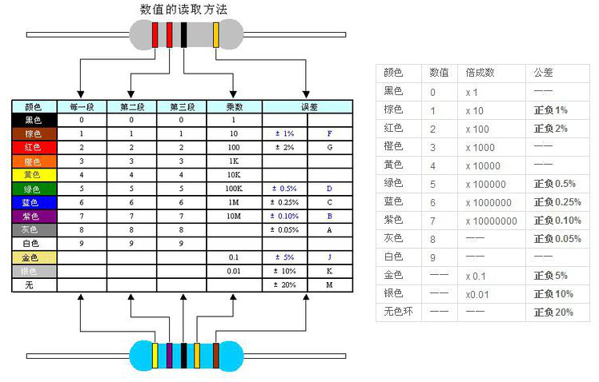

# 电子元件参数标识方法

## C

### 电容

#### 数码表示法
+ 核心规则：用 2~3 位数字表示容量，单位默认 **pF**；若含字母（如 `104J`），前 2 位为有效数字，第 3 位为 10 的幂次，字母表示误差等级。
+ 误差等级对应：J(±5%)、K(±10%)、M(±20%)
+ 示例：
    - `104J` = 10 × 10⁴ pF = 100000 pF = 0.1 μF，误差 ±5%
    - `223K` = 22 × 10³ pF = 22000 pF = 22 nF，误差 ±10%
    - `330` = 33 pF（无幂次位，直接表示数值）

---

## R

### 电阻

#### 颜色表示法

#### 数码表示法
+  **三位数码法**
    + 核心规则：前 2 位为有效数字，第 3 位为 10 的幂次，单位默认 **Ω**；字母表示误差（无字母默认 ±20%）。
    + 误差等级对应：F(±1%)、G(±2%)、J(±5%)、K(±10%)
    + 示例：
        - `104J` = 10 × 10⁴ Ω = 100000 Ω = 100 kΩ，误差 ±5%
        - `221K` = 22 × 10¹ Ω = 220 Ω，误差 ±10%
+  **四位数码法（精密电阻）**
    + 核心规则：前 3 位为有效数字，第 4 位为 10 的幂次，用于表示精度更高的电阻。
    + 示例：
        + `1001F` = 100 × 10¹ Ω = 1000 Ω = 1 kΩ，误差 ±1%

