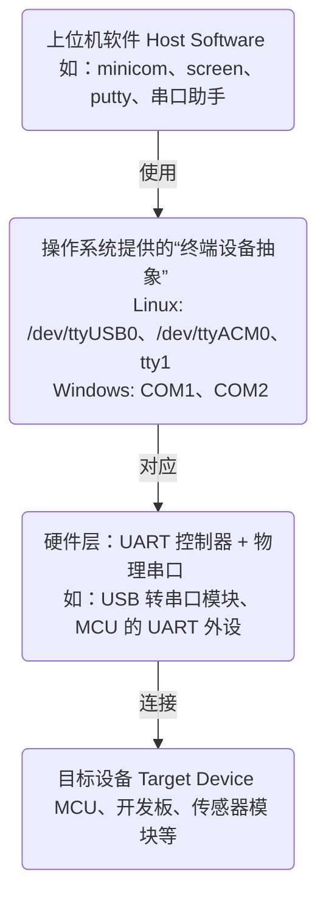

# 软件工具

## O

### OpenOCD
+ 开源片上调试器(On-Chip Debugger)
    + 通过JTAG/SWD实现

---

## T

### tty
+ TeleTYpewriter
+ 系统接口 / 设备文件
+ Linux/Unix 系统中对终端设备的抽象表示，用于访问串口、虚拟终端等输入输出设备。在嵌入式开发中常用于通过 UART 与 MCU 通信、查看调试信息或与 Bootloader 交互

